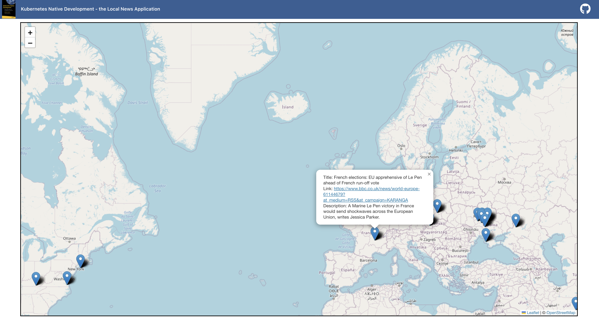
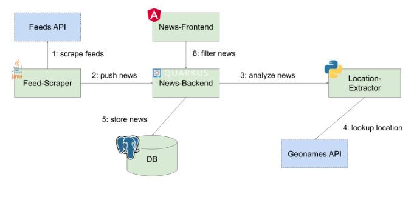

# Local News Application

## Overview

The Local News application is used as a sample in the book 
[Kubernetes Native Development](https://www.amazon.de/Kubernetes-Native-Development-Develop-Applications/dp/1484279417) by Benjamin Schmeling and Max Dargatz. It serves to demonstrate a wealth of concepts to use Kubernetes along the software lifecycle.

As the name implies, it is about displaying news. The location where the respective news is placed on the map depends on the location mentioned in the news' text. An example would be a news article with the following title: "Next Sunday, there will be the Museum Embankment Festival in Frankfurt". The Local News application will analyze the text based on Natural Language Processing (NLP), will find out that the news refers to Frankfurt, and will place it into the city of Frankfurt on the map. Figure 2-1 shows a screenshot of the user interface for the local news application. The pins represent the respective news and when the user clicks on it it will display the details about the news.  

The above image provides a brief overview of the components.
First of all, there is a Feed-Scraper which is regularly polling a set of given news feeds and will send the news data such as title and description to the News-Backend. The News-Backend first stores the news data in a database and then sends a request to the Location-Extractor in order to analyze the text, extract the name of the location (only the first location that is found is considered), and return it to the backend. The response will contain the longitude and latitude of the location which will then be added to original news data and updated in the database. If a user wants to see the map with the news, she can use the News-Frontend. This web application renders the map with the news by requesting the news, in the bounds defined by the map's current clipping, from the News-Backend. The backend queries its database and returns the news with the stored location. The front end marks the map with the news' location and if the user hovers over the markers she will see the news text.  

## Container Registry
https://quay.io/organization/k8snativedev

## Trying it out
The easiest way is to deploy it with Helm and access the frontend via NodePort.

    kubectl create ns localnews
    helm install localnews k8s/helm-chart -n localnews