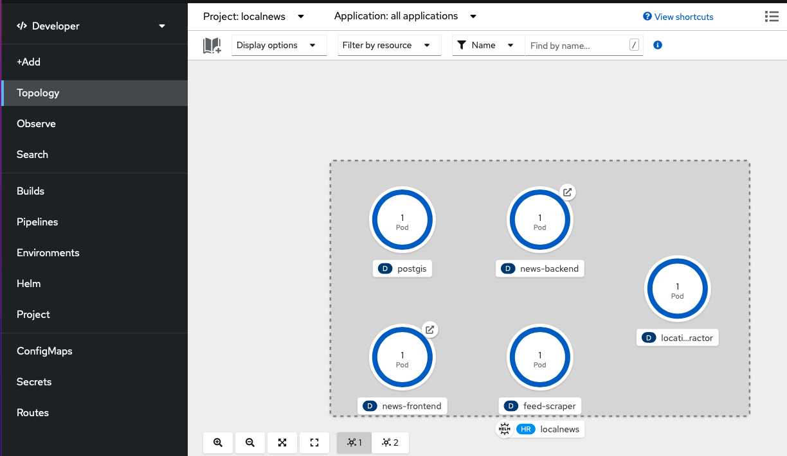
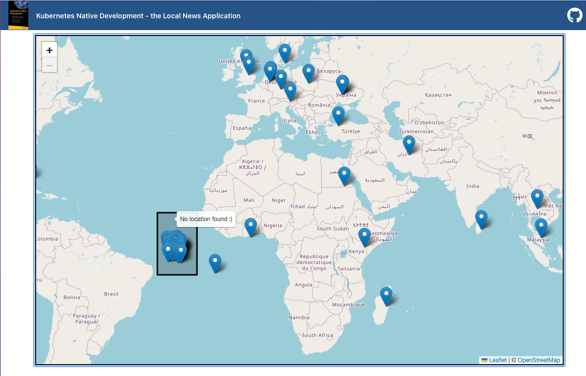

# Deploy Local News to OpenShift
This tutorial describes how to deploy the local news application to OpenShift. This has been tested on OCP 4.10.

## Clone the repository
    git clone https://github.com/Apress/Kubernetes-Native-Development

## Create a new project
    OCP_PROJECT=localnews 
    oc new-project $OCP_PROJECT
    
## Deploy the Local News application via Helm 
    OCP_DOMAIN=$(oc whoami --show-server=true | sed -E 's/https:\/\/api\.|:6443//g')
    helm upgrade -i localnews k8s/helm-chart -f k8s/helm-chart/values-openshift.yaml \
    --set localnews.domain=$OCP_DOMAIN
    
## Verify the deployment
Switch back to the Developer perspective in the OpenShift console. You should see all 5 components deployed with 1 replica each.

I you click on the route symbol on the top right of the news-backend circle you should see the map rendering multiple news.

If you prefer to use the cli you can just list all pods and check its STATUS

    oc get pods
    NAME                                  READY   STATUS    RESTARTS   AGE
    feed-scraper-744f54d945-fbk66         1/1     Running   0          7m25s
    location-extractor-66446dd9b7-nfsbw   1/1     Running   0          7m25s
    news-backend-59574c4f79-54vjf         1/1     Running   0          7m25s
    news-frontend-579f47575b-p5llf        1/1     Running   0          7m25s
    postgis-74997b5bb9-shjzp              1/1     Running   0          7m25s

    
    
