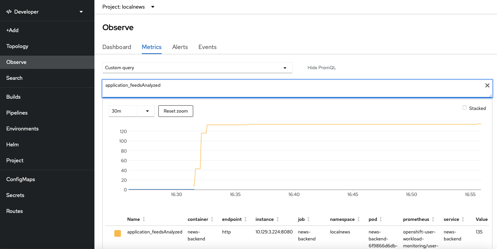
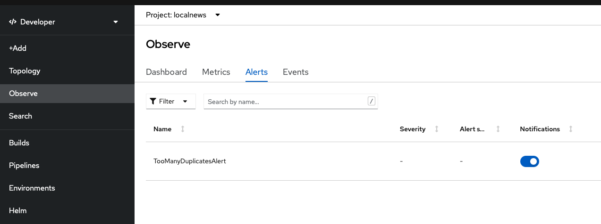

# User Workload Monitoring 
This tutorial describes how to leverage the user workload monitoring feature of OpenShift to collect and visualize application-specific metrics. This has been tested on OCP 4.10.

## Prerequisites 
The tutorial expects that you have already created a project, e.g. 'localnews' in OpenShift. Make sure to set the OCP_PROJECT and OCP_DOMAIN variables because they will be used throughout the following commands.

    OCP_PROJECT=localnews 
    oc project $OCP_PROJECT
    OCP_DOMAIN=$(oc whoami --show-server=true | sed -E 's/https:\/\/api\.|:6443//g')
    
Furthermore, make sure that you have enabled User Workload Monitoring in your target OpenShift cluster by following the official [docs](https://docs.openshift.com/container-platform/4.11/monitoring/enabling-monitoring-for-user-defined-projects.html). 
    
## Enable Workload Monitoring for Local News
You can enable workload monitoring by setting the respective flag implemented as Helm parameter.  
  
    helm upgrade -i localnews k8s/helm-chart -f k8s/helm-chart/values-openshift.yaml \
    --set localnews.domain=$OCP_DOMAIN \
    --set localnews.workloadmonitoring="on"

## Which additional resources have been created?

Check for the ServiceMonitor custom resource that have been created. There should be two ServiceMonitor resources, one for the news backend and one for the location extractor. Furthermore, there is a helm template for creating a ProemtheusRule for demonstrating alerts.  

    oc get servicemonitor,PrometheusRule
    NAME                         AGE
    location-extractor-monitor   2m10s
    news-backend-monitor         2m10s
    NAME                                                    AGE
    prometheusrule.monitoring.coreos.com/duplicates-alert   10h

The service monitors tell the Prometheus responsible for user workload monitoring to scrape the metrics.

## How to observe the collected metrics
The benefit to stick to user workload monitoring is not only that OCP takes over the responsibility for collecting the application metrics but you can also visualize them directly in the console. Make sure you are in the Developer perspective and navigate to Observe. Then select the Metrics tab and choose Custom query. Type, for instance, application_duplicateFeeds and see the results.

## How to observe the alerts
Make sure you are in the Developer perspective and navigate to Observe. Select the Alerts tab to watch for the alert firing when there are more than 50 duplicate news.

