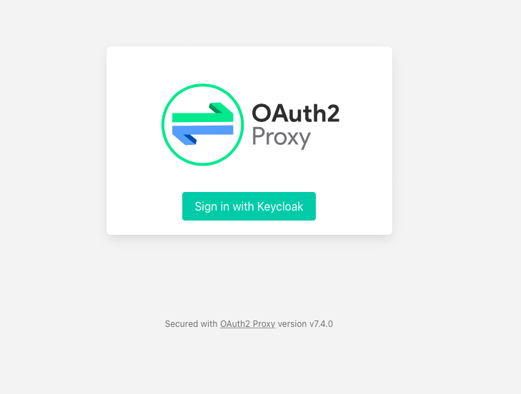

# Single Sign on
This tutorial describes how to setup single sing on (SSO) for the local news application. This has been tested on OCP 4.10.

## Prerequisites 
The tutorial expects that you have already created a project, e.g. 'localnews' in OpenShift. Make sure to set the OCP_PROJECT and OCP_DOMAIN variables because they will be used throughout the following commands. 

    OCP_PROJECT=localnews 
    oc new-project $PROJECT-sso
    oc project $OCP_PROJECT
    OCP_DOMAIN=$(oc whoami --show-server=true | sed -E 's/https:\/\/api\.|:6443//g')
    
In this tutorial, we will install an instance of RHSSO. Hence, we created a new project in the previous steps. Make sure to install the RHSSO operator from the OperatorHub into this project. Alternatively, you can install it via cli. If your target namespace does not equal 'localnews-sso', please make sure that you change the targetNamespaces snippets/uc3-sso/rhsso/rhsso-operatorgroup.yaml accordingly.

    oc -n $PROJECT-sso apply -f snippets/uc3-sso/rhsso   
    
## Deploy the SSO CRs and the Oauth proxy
You can deploy all necessary resources for SSO by setting the respective flag implemented as Helm parameter.  
  
    helm upgrade -i localnews k8s/helm-chart -f k8s/helm-chart/values-openshift.yaml \ 
    --set localnews.domain=$OCP_DOMAIN \
    --set localnews.sso.enabled="on"

## Which additional resources have been created?

For the RHSSO the following resources will be created:  

     oc -n $OCP_PROJECT-sso get keycloakuser,keycloakrealm,keycloakclient,keycloak
     NAME                                           AGE
     keycloakuser.keycloak.org/localnews-testuser   21m
     NAME                                         AGE
     keycloakrealm.keycloak.org/localnews-realm   21m
     NAME                                           AGE
     keycloakclient.keycloak.org/localnews-client   21m
     NAME                                  AGE
     keycloak.keycloak.org/localnews-sso   21m
     
In addition, we add a sidecar oauth proxy to the news frontend which will listen on port 4180. To redirect the traffic to the proxy we also change the news frontend service port.

## How can I test SSO? 
To test the mandatory authentication for the news frontend just open the frontend route. You will now see a login link.  

This will redirect us to the login page of the RHSSO server. We can use the credentials of the testuser (username: test, password: test).

## Limitations
The demonstrated approach is non-invasive but also limited. Firstly, we cannot pass the access token along with our xhr requests and secondly we also need to secure the news backend because it is publicly accessible via its route. To achieve the latter we can employ the OpenShift service mesh.