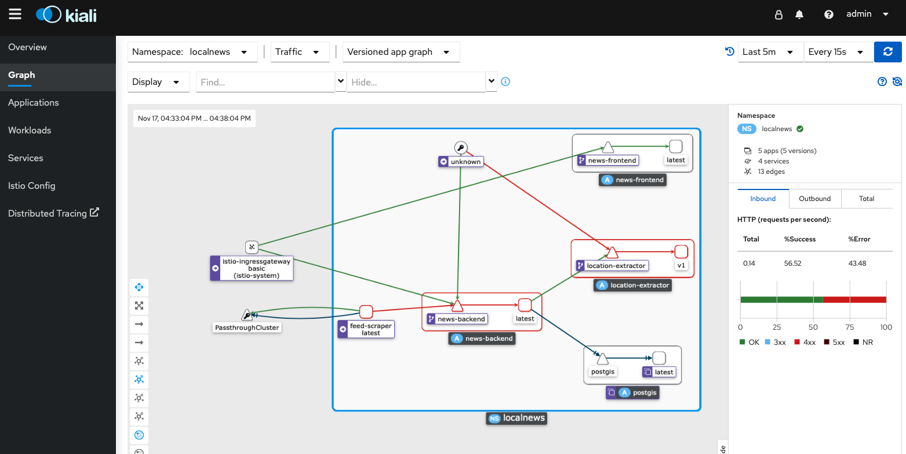

# OpenShift Service Mesh
This tutorial describes how to deploy the local news application into a service mesh to gain additional observability and security. This has been tested on OCP 4.10 with Red Hat OpenShift ServiceMesh 2.3.0.

## Prerequisites 
The tutorial expects that you have already created a project, e.g. 'localnews' in OpenShift. Make sure to set the OCP_PROJECT and OCP_DOMAIN variables because they will be used throughout the following commands.

    OCP_PROJECT=localnews
    oc project $OCP_PROJECT
    OCP_USER=$(oc whoami)
    OCP_MESH_PROJECT=istio-system
    OCP_DOMAIN=$(oc whoami --show-server=true | sed -E 's/https:\/\/api\.|:6443//g')
    
Furthermore, make sure that you have istalled the OpenShift Service Mesh in your target OpenShift cluster by following the offical [docs](https://docs.openshift.com/container-platform/4.11/service_mesh/v2x/installing-ossm.html). 
    
## Enable Service Mesh for Local News
You can enable the service mesh simply by setting the respective flag implemented as Helm parameter. However, your user requires the mesh-user role in order to register the project as a Service. Otherwise you will get a permission error.
  
    oc policy add-role-to-user -n istio-system --role-namespace istio-system mesh-user $OCP_USER
    helm upgrade -i localnews k8s/helm-chart -f k8s/helm-chart/values-openshift.yaml \ 
    --set localnews.domain=$OCP_DOMAIN \
    --set localnews.servicemesh="on" \
    
## Further configuration options
The chart has several configuration options regarding service mesh. 

| Key | Type | Default | Description |
|-----|------|---------|-------------|
| localnews.mesh.controlplane.name | string | `"basic"` | The name of the service mesh controlplane CR  |
| localnews.mesh.controlplane.namespace | string | `"istio-system"` | The namespace of the service mesh controlplane |
| localnews.mesh.dataplane.mtls.strict | string | `"off"` | Switch from permissive to strict mode by setting this to 'on'  |
| localnews.servicemesh | string | `"off"` | Enables service mesh for all components except the database |

## Ensure the injection of istio-proxy  
To be part of the service mesh, an istio-proxy sidecar needs to be injected into the pods. Check whether this is the case by

    oc get pods
    NAME                                 READY   STATUS    RESTARTS   AGE
    feed-scraper-567f4bfb68-57dgv        1/1     Running   0          60s
    location-extractor-c8879b7cd-r89sq   1/1     Running   0          60s
    news-backend-6ff7d4cddd-4wdw8        1/1     Running   0          60s
    news-frontend-5c56898745-fjsld       1/1     Running   0          60s
    postgis-74997b5bb9-s9nmv             1/1     Running   0          73m
    
If the number of containers being ready is still 1/1 restart all deployments to enforce the injection

    oc rollout restart deployment {news-backend,news-frontend,feed-scraper,location-extractor}
    oc get pods
    NAME                                 READY   STATUS    RESTARTS   AGE
    feed-scraper-567f4bfb68-57dgv        2/2     Running   0          120s
    location-extractor-c8879b7cd-r89sq   2/2     Running   0          120s
    news-backend-6ff7d4cddd-4wdw8        2/2     Running   0          120s
    news-frontend-5c56898745-fjsld       2/2     Running   0          120s
    postgis-74997b5bb9-s9nmv             1/1     Running   0          73m

## Access the application via gateway route
To enter the service mesh the traffic must pass the istio gateway. Thus, a new route has been generated in the namespace where the service mesh control plane has been installed (istio-system by default). 

    oc -n $OCP_MESH_PROJECT get routes
    NAME                                     HOST/PORT                                      PATH    SERVICES               PORT
    localnews-news-backend-07fc8cfe7781d97b  news-backend-localnews.apps.ocp4.example.com           istio-ingressgateway   http2
    localnews-news-frontend-d3930778b01f42a0 news-frontend-localnews.apps.ocp4.example.com          istio-ingressgateway   http2

If you can't access routes in the service mesh namespace, you could generate the url by:

    echo http://news-frontend-$_OCP_PROJECT-$OCP_DOMAIN
    http://news-frontend-localnews.apps.example.com

## View the service graph in Kiali
In the topology view of the Developer perspective click on the Kiali link on the top right. You can explore the traffic between the different pods in the service graph by selecting your project in the namespace filter.

